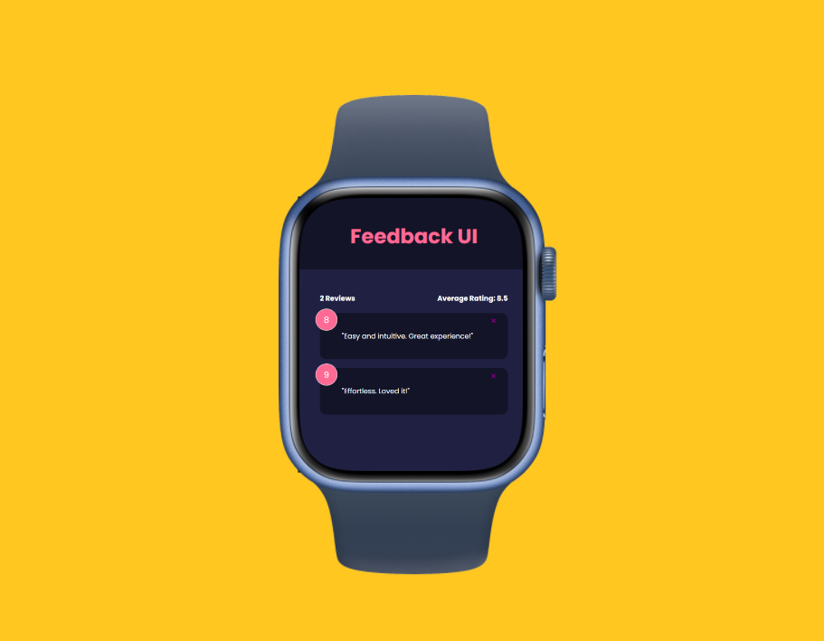

# Feedback App

The Feedback App is a user-friendly web application built using React that allows users to provide feedback, comments, and reviews effortlessly. It simplifies the process of collecting and managing user feedback while providing an engaging and responsive user interface.

## Table of Contents

- [Features](#features)
- [Usage](#usage)
- [Contributing](#contributing)
- [License](#license)
- [Demo](#demo)

## Features

- **Feedback Submission**: Users can easily submit their feedback by typing it into the input field and clicking a submit button.

- **Feedback Display**: Submitted feedback is displayed in an organized and visually appealing manner, making it easy for users to view their feedback and for others to read and interact with it.

- **Average Rating Calculation**: The app calculates and displays the average rating based on the feedback provided, helping users get a quick overview of the overall sentiment.

- **Responsive Design**: The app is designed to work seamlessly on various devices, including desktops, tablets, and mobile phones, ensuring a great user experience for all.

- **User-Friendly Interface**: The intuitive and user-friendly interface makes it easy for users of all technical levels to navigate and provide feedback.

- **Submission Validation**: Feedback submission is validated to ensure that users provide meaningful content, enhancing the quality of the feedback collected.

## Usage

1. Clone the repository to your local machine.
2. Run `npm install` to install the required dependencies.
3. Use `npm start` to launch the application locally.
4. Open your web browser and navigate to `http://localhost:3000` to access the Feedback App.

## Contributing

Contributions are welcome! Whether you want to add new features, fix bugs, or improve the documentation, please feel free to open issues and pull requests.

## License

This project is licensed under the MIT License. See the [LICENSE](LICENSE) file for details.

## Demo

You can access a live demo of the Feedback App [here](#) (insert the link to your live demo if available).

---

Replace the placeholders with actual links, descriptions, and information relevant to your project. This README.md template includes a table of contents with anchor links that point to the corresponding sections within the document. When users click on a section title in the table of contents, they will be directed to that section within the README.md file.
